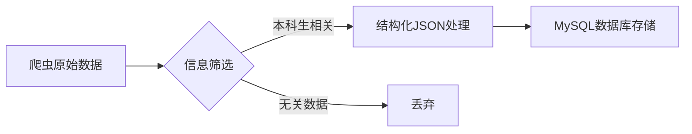

# 信息处理流程

# 代码框架
| 文件/目录                | 功能描述                               |
|--------------------------|----------------------------------------|
| `ai_processing.py`       | 主执行程序，写有数据处理的代码，完成信息处理，导入数据库的工作。接口是待处理的md文档的本地路径MARKDOWN_PATH |
| `prompt_structuring.txt` | 数据结构化的提示词                  |
| `db_importer.py`         | json导入模块，包含： - `save_to_database()` 数据插入函数 - `generate_sql()` SQL生成函数 - `process_item()`  `parse_datetime()` 数据清洗函数 |

# 相关配置
1. 接口路径MARKDOWN_PATH，要求接收md格式的文档，且文档最后要**附上原文链接**
2. 大模型API设置
3. 数据库配置DB_CONFIG

# 后续优化
1. 把报错存入日志，便于检查
2. 增加防止重复导入验证（虽然cxl说爬虫会保证这一点，但如果历史消息有更新或有其他添加数据的需求，这样的功能会使更新数据库操作更简单）
